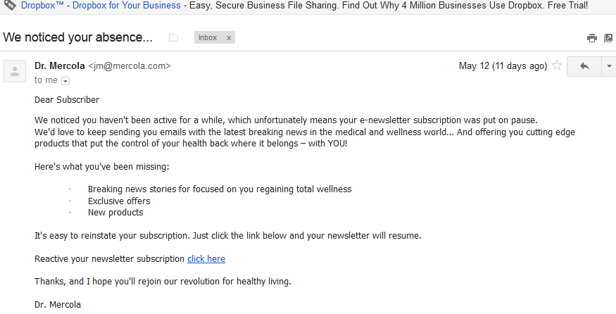

# God praxis för återengagemang {#re-engagement}

Vid implementering av leverans handlar några av de bästa sätten att försöka upprätthålla en sund prenumerantbas och förbättra leveransen genom återengagemang (eller återvinning).

* Att upprätthålla en sund prenumerationsbas är en av de viktigaste aspekterna för att säkerställa bra och enhetlig leverans. Många leveransproblem kan uppstå till följd av dålig datahantering och dåligt underhåll.
* Ett av de vanligaste problemen som marknadsförare står inför idag är inaktiv prenumerationsaktivitet (kallas även låg eller utebliven interaktion) som kan påverka e-postleveransen negativt och få avkastning.

>[!NOTE]
>
>Om du vill ha mer information om strategier för återengagemang i kampanjer och Adobe’s Deliverability Services kontaktar du din Deliverability-konsult eller pratar med din säljare på Adobe.

## Hur visar internetleverantörer icke-engagemangsaktiviteter? {#how-do-isps-view-non-engagement-activity-}

I åratal har internetleverantörer använt feedback från sina användare för att bestämma var de ska skicka meddelanden, eller om de alls ska leverera dem. Användaren [engagemang](/help/engagement.md) består av både positiv och negativ feedback och Internet-leverantörer övervakar båda kontinuerligt. Att inte engagera sig är kanske en av de viktigaste aktörerna i ett negativt engagemang. Ur ett leveransperspektiv kan ni också sänka det totala anseendet för er IP-adress och domäner genom att kontinuerligt skicka kampanjer till användare som inte visar något engagemang.

Internetleverantörer som Gmail, Microsoft® och OATH ser att de inte är engagerade som oönskad e-post och börjar omdirigera meddelanden till skräppostmappen. Dessa prenumeranter kanske inte längre äger e-postkontot och detta kan användas som en&quot;återvunnen&quot; skräppostsvällning. Det innebär att adressen var ogiltig en tid och att alla meddelanden avvisas. Om prenumeranthanteringssystemet inte tar bort adresserna som &quot;studsar hårt&quot; är det troligt att skräppostsvällningar skickas som kan leda till betydande leveransproblem.

## Hur ska du närma dig inaktivitet? {#how-should-you-approach-inactivity-}

Kunder som använder Adobe-plattformen kan se inaktivitet i sin instans genom att granska öppna och klicka på data enligt segmentet. Eftersom ett uteblivet engagemang kan hindra leveransen kan det vara en första idé att ta bort prenumeranter från databasen. Detta kan dock visa sig vara ett felaktigt alternativ ibland. Därför är en strategi för återengagemang (även kallad återkoppling) den bästa rekommendationen att behålla de abonnenter som är intresserade av att få e-post och gradvis fasa ut dem som inte längre uppvisar någon aktivitet.

## Fungerar verkligen återengagemangskampanjer? {#do-re-engagement-campaigns-really-work-}

Enligt en studie av Return Path resulterade återengagemangskampanjer i en öppen frekvens på 12 % jämfört med ett genomsnitt på 14 % för normala kampanjer. Även om bara 24 % av prenumeranterna hade läst kampanjen om återengagemang, läste ungefär 45 % av dem de följande meddelandena.

## Hur skapar ni en återengagemangskampanj? {#how-do-you-create-a-re-engagement-campaign-}

### Fas 1 {#phase-1}

* Det första steget är att identifiera prenumeranter som har lite till ingen öppnings- eller klickaktivitet och segmentera gruppen utifrån en bestämd tidsram. Regeln med tummen är att granska prenumeranter som inte har öppnat eller klickat på ett e-postmeddelande inom de senaste 90 dagarna. Detta varierar dock beroende på verksamhetens art (till exempel säsongsbunden sändning).
* En annan sak som du bör tänka på när du definierar tidsramar är att internetleverantörer och företag som blocklist anser att engagemang är var som helst mellan 1,5 och 1,8 år. Beteendeaktiviteter som inköp och webbplatsaktivitet eller andra kontaktpunkter, som inställningar under registreringsfasen eller den första kontaktpunkten.

### Fas 2 {#phase-2}

* När ett segment har definierats är nästa steg att skapa en återengagemangskampanj som fångar upp abonnenten enligt de mätvärden som har identifierats. Genom att skapa en ämnesrad ökar abonnentens intresse. Enligt en Return Path-studie genererar ämnesrader och innehåll där det står&quot;We missing you&quot; högre svarsfrekvens än&quot;We want you back&quot;.
* Man kan också erbjuda ett incitament att återengagera sig i e-postmeddelandet. När du överväger erbjudanden med rabatt är det bäst att använda dollarbelopp jämfört med procentandelar. Return Path föreslår också detta eftersom det ger högre svarsfrekvens. Att utföra A/B-tester för att granska respons och svarsfrekvens är också ett användbart alternativ.

### Fas 3 {#phase-3}

Nästa steg är att fastställa frekvensen för återengagemangskampanjen. Till skillnad från bekräftelsemeddelanden är återengagemangskampanjer avsedda att vinna tillbaka abonnenten med en serie e-postmeddelanden över tiden. I följande exempel visas ett exempel på frekvensen.

Prenumeranter som interagerar med kampanjen genom att följa öppnings- eller klickaktiviteten läggs tillbaka i den engagerade listan över prenumeranter.

### Fas 4 {#phase-4}

* Nästa fas är att identifiera abonnenter som ständigt inte uppvisar någon aktivitet och gradvis minska antalet utskick av e-post till dem under en tidsperiod. Om det inte finns någon aktivitet under det senaste året är det bra att spärra prenumeranternas e-postprenumeration. Även om de inte har visat något intresse för e-postinnehållet finns det alltid en sista möjlighet att få dem att återaktivera sin prenumeration genom att skicka en engångsåterbekräftelsekampanj.
* Bekräftelsekampanjer är ett bra sätt att fråga prenumeranter som är inaktiva länge om de vill stanna kvar i prenumerationslistan. När du skapar kampanjen är det bättre att lägga till en&quot;klicka här&quot;-länk så att de kan bekräfta åtgärden och verifiera deras adress. På så sätt kan funktionsmakrot registreras i databasen. Nedan visas ett exempel på en e-postbekräftelse:

   

   När abonnenten har vidtagit en åtgärd kan en landningssida med en bekräftelse på att han eller hon har betalat prenumerationen visas. Nedan visas ett exempel på landningssidan:

   

## Produktspecifika resurser

**Adobe Campaign**

* [Spårningsloggar i Campaign Classic](https://experienceleague.adobe.com/docs/campaign-classic/using/sending-messages/monitoring-deliveries/delivery-dashboard.html#tracking-logs)
* [Spårningsloggar i Campaign Standard](https://experienceleague.adobe.com/docs/campaign-standard/using/testing-and-sending/sending-and-tracking-messages/tracking-messages.html#tracking-logs)

**Adobe kundresehantering**

* [Meddelandespårning](https://experienceleague.adobe.com/docs/journey-optimizer/using/reporting/message-tracking.html)
